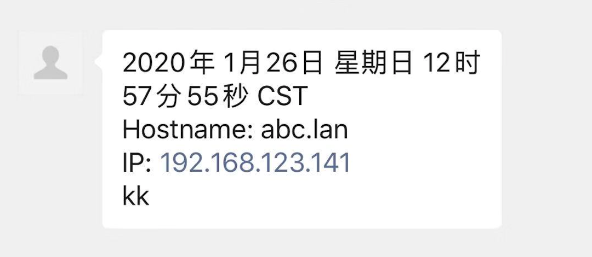
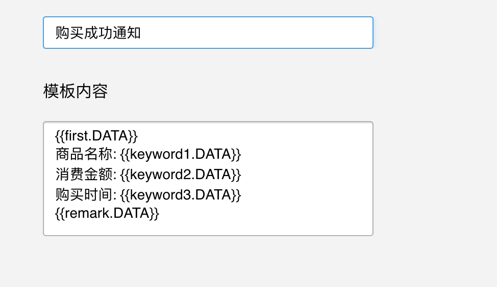
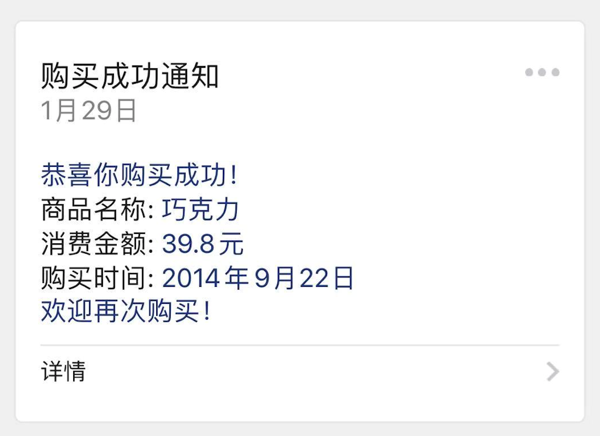

**微信公众号消息推送测试**


**版本更新说明:**

- shell脚本运行形式，macOS测试可用， 默认推送第一个关注者
- 新增模版消息推送


**获取测试信息:**

*  登陆[微信公众平台测试号](http://mp.weixin.qq.com/debug/cgi-bin/sandbox?t=sandbox/login)
*  获取测试号信息(appid, appsecret)
*  获取关注者，在用户列表添加测试关注者(OpenID)


**配置文件:**

参数说明

| 参数       | 是否必须 | 说明                           |
| ---------- | -------- | ------------------------------ |
| appID      | 是       | 唯一凭证                       |
| appSecret  | 是       | 唯一凭证密钥，即appsecret      |
| openID     | 是       | 关注者ID，默认调用第一次关注者 |
| templateID | 否       | 推送客服消息时不需要           |


**一、客服消息**

**1) 发送内容:**

```json
{
    "touser":"'$openID'",
    "msgtype":"text",
    "text":{
        "content":"Hello world"
    }
}
```

参数说明:

详情请参考[官方文档](https://developers.weixin.qq.com/doc/offiaccount/Message_Management/Service_Center_messages.html)说明


**2) 推送测试:**

```sh
sh CS_PushWechat.sh Msg
```

Msg：要推送的消息内容


推送成功返回:

```json
{"errcode":0,"errmsg":"ok"}
```


推送成功效果如下:




**二、模版消息**

**1) 新建自定义模版内容如下：**

```
{{first.DATA}}
商品名称: {{keyword1.DATA}}
消费金额: {{keyword2.DATA}}
购买时间: {{keyword3.DATA}}
{{remark.DATA}}
```




**2) 发送内容:**

```json
{
    "touser":"'$OpenID'",
    "template_id":"'$template_id'",
    "url":"https://abone.xyz",
    "data":{
        "first":{
            "value":"恭喜你购买成功！",
            "color":"#173177"
        },
        "keyword1":{
            "value":"巧克力",
            "color":"#173177"
        },
        "keyword2":{
            "value":"39.8元",
            "color":"#173177"
        },
        "keyword3":{
            "value":"2014年9月22日",
            "color":"#173177"
        },
        "remark":{
            "value":"欢迎再次购买！",
            "color":"#173177"
        }
    }
}
```

参数说明:

详情请参考[官方文档](https://developers.weixin.qq.com/doc/offiaccount/Message_Management/Template_Message_Interface.html)说明


**3) 推送测试:**

```sh
sh Template_PushWechat.sh
```


推送成功返回:

```json
{"errcode":0,"errmsg":"ok","msgid":1185191290833616896}
```


推送成功效果如下:



